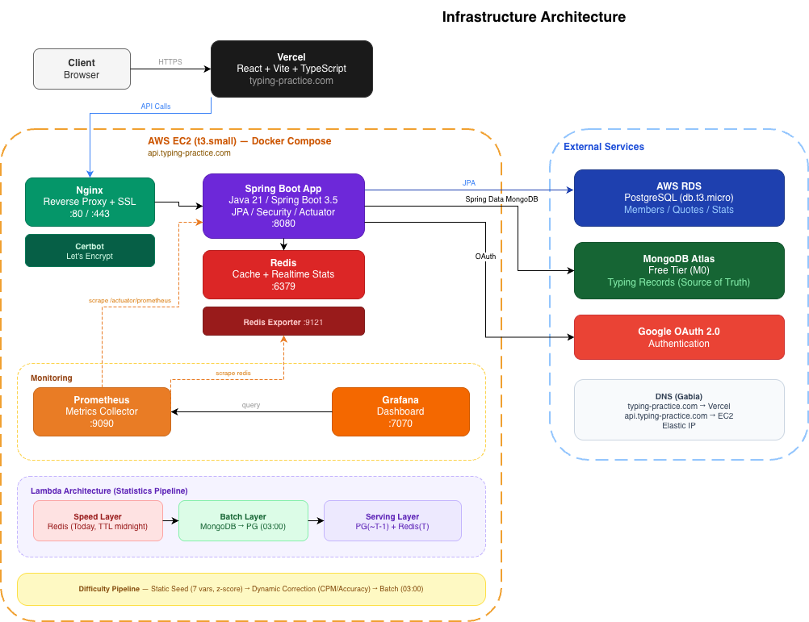

# Typing Practice

한국어/영어 타자 연습 웹 서비스

🔗 **서비스**: https://typing-practice.com

## 프로젝트 소개

문장을 타이핑하며 타자 속도(CPM)와 정확도를 측정하는 웹 서비스입니다. 사용자가 직접 문장을 업로드하고, 타이핑 기록을 바탕으로 문장 난이도가 동적으로 보정됩니다.

## 주요 기능

- 한국어/영어 문장 타이핑 연습 및 실시간 CPM, 정확도 측정
- Google OAuth 로그인
- 문장 업로드 (언어 검증 + 유사 문장 탐지)
- 데이터 기반 문장 난이도 동적 보정
- 사용자 타이핑 통계 (일별, 누적, 오타 분석)
- 어드민 문장 관리 및 승인

## 기술 스택

### Backend

- Java 21, Spring Boot 3.5.8, Gradle
- Spring Security + JWT (Google OAuth)
- Spring Data JPA (PostgreSQL)
- Spring Data MongoDB
- Spring Data Redis (Lettuce)
- Micrometer + Prometheus (모니터링)

### Frontend

- React 18, Vite, TypeScript
- React Router DOM
- Axios

### Infrastructure

- AWS EC2 (t3.small), Docker Compose
- AWS RDS (PostgreSQL), MongoDB Atlas, Redis
- Nginx (리버스 프록시) + Let's Encrypt (HTTPS)
- Prometheus + Grafana + Redis Exporter
- Vercel (프론트엔드 배포)

## 아키텍처

### 인프라 구성



### Lambda Architecture (통계 파이프라인)

타이핑 기록의 수집, 집계, 조회를 3개의 데이터 소스로 분리하여 처리합니다.

- **MongoDB** — 타이핑 기록 원본 저장 (Source of Truth)
- **Redis** — 당일 실시간 통계 캐시 (TTL 자정 만료, 증분 업데이트)
- **PostgreSQL** — 배치 확정 통계 (새벽 3시 배치로 전일치 적재)
- **Serving Layer** — 조회 시 PostgreSQL(~어제) + Redis(오늘) 합산 응답

### 문장 난이도 산출

1. **정적 난이도 (Seed)**: 자모 복잡도, 겹모음 비율 등 7가지 변수를 z-score 정규화하여 신규 문장의 초기 난이도 산출 (Cold Start 해결)
2. **동적 보정**: 사용자별 평균 CPM, 정확도, 초기화 횟수를 수집하여 배치 단위로 난이도 보정

### 랜덤 문장 조회 최적화

`ORDER BY RANDOM()` → Redis 기반 ID 캐시 + 애플리케이션 셔플로 전환하여 조회 성능 개선

## 프로젝트 구조

```
typing-practice/
├── tp-react/                    # 프론트엔드 (React + Vite + TypeScript)
└── typing-practice-be/          # 백엔드 (Spring Boot)
    ├── Dockerfile
    ├── docker-compose.yaml      # 로컬 개발 환경
    ├── docker-compose.prod.yaml # 운영 환경
    ├── prometheus-local.yml
    ├── prometheus-prod.yml
    ├── k6/                      # 부하 테스트 스크립트
    └── src/main/java/.../
        ├── auth/                # 인증 (Google OAuth, JWT)
        ├── member/              # 회원 관리
        ├── quote/               # 문장 (CRUD, 난이도 계산, 유사도 검증)
        │   ├── service/difficulty/  # 정적/동적 난이도 계산
        │   ├── statistics/          # 문장별 타이핑 통계
        │   └── reject/             # 유사 문장 거부 로그
        ├── typingrecord/        # 타이핑 기록
        │   ├── statistics/          # 사용자 통계 (일별, 누적, 오타)
        │   └── event/              # 기록 저장 이벤트
        ├── statistics/          # 통계 조회 (Serving Layer)
        ├── report/              # 신고
        ├── dailylimit/          # 일일 업로드 제한
        ├── config/              # Security, Swagger 설정
        └── common/              # JWT, 공통 DTO, 예외 처리
```

## 로컬 개발 환경 실행

### 사전 준비

- Java 21
- Docker, Docker Compose
- Node.js 18+

### 백엔드

```bash
cd typing-practice-be

# 로컬 DB 컨테이너 실행 (PostgreSQL, Redis, MongoDB, Prometheus, Grafana)
docker compose up -d

# .env.local 파일 생성 (아래 환경변수 설정)
# 앱 실행 (IntelliJ 또는 Gradle)
```

### 프론트엔드

```bash
cd tp-react
npm install
npm run dev
```

### 환경변수 (.env.local / .env.prod)

```
DB_URL=jdbc:postgresql://localhost:5432/typing
DB_USERNAME=
DB_PASSWORD=
MONGODB_URI=
JWT_SECRET=           # 최소 32자 이상
GOOGLE_CLIENT_ID=
GOOGLE_CLIENT_SECRET=
GOOGLE_REDIRECT_URI=
ADMIN_EMAIL=
```

## 운영 환경 배포

EC2에서 Docker Compose로 전체 스택을 실행합니다.

```bash
cd typing-practice-be
docker compose -f docker-compose.prod.yaml up --build -d
```

### 운영 컨테이너 구성

| 서비스            | 이미지                      | 포트      | 역할              |
|----------------|--------------------------|---------|-----------------|
| app            | Dockerfile (멀티 스테이지 빌드)  | 8080    | Spring Boot 앱   |
| redis          | redis:8                  | 6379    | 캐시 + 실시간 통계     |
| nginx          | nginx:alpine             | 80, 443 | 리버스 프록시 + HTTPS |
| certbot        | certbot/certbot          | -       | SSL 인증서 발급/갱신   |
| prometheus     | prom/prometheus          | 9090    | 메트릭 수집          |
| grafana        | grafana/grafana          | 7070    | 모니터링 대시보드       |
| redis-exporter | oliver006/redis_exporter | 9121    | Redis 메트릭 수집    |

## 부하 테스트 (k6)

k6를 사용하여 5종의 부하 테스트를 수행했습니다.

| 테스트       | 시나리오           | 동시 사용자 | 평균 응답  | p95     | 에러율 |
|-----------|----------------|--------|--------|---------|-----|
| Load      | 기본 부하          | 10명    | 33.7ms | 45.3ms  | 0%  |
| Stress    | 점진적 증가         | 150명   | 38.3ms | 63.1ms  | 0%  |
| Spike     | 급격한 트래픽        | 200명   | 53.7ms | 103.2ms | 0%  |
| Mixed     | 읽기/쓰기 혼합 스파이크  | 200명   | 1.95s  | 4.93s   | 0%  |
| Realistic | 실제 사용 패턴 시뮬레이션 | 200명   | 28.3ms | 44.1ms  | 0%  |

- HikariCP pool size 10 → 20 변경 시 오히려 성능 저하 확인 (RDS db.t3.micro CPU 병목)
- 비현실적 부하(매초 쓰기)에서만 커넥션 풀 병목 발생, 실제 사용 패턴에서는 문제없음

## 모니터링

Grafana 대시보드를 통해 실시간 모니터링합니다.

- JVM (Micrometer) — 힙 메모리, GC, 스레드, CPU
- Spring Boot 3.x Statistics — HTTP 요청, HikariCP, 응답 시간
- Redis Dashboard — 메모리, 커넥션, 명령어 처리량

## 개발자

HongnamKim